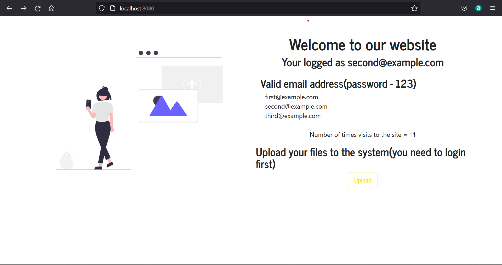

# Express app which implements basic authentication and file upload

---
### Third party frameworks which used in this project
1. [Ejs - Template engine](https://ejs.co/)
2. [Express - Web framework for Node.js](https://expressjs.com/)
3. [Express sessions - Used for creating sessions ](https://www.npmjs.com/package/express-session)
4. [Multer - File uploading library](https://www.npmjs.com/package/multer)
5. [Passport js - Authentication for Node.js](https://www.passportjs.org/)
6. [Nodemon - For easy development process](https://www.npmjs.com/package/nodemon)

---
### How to run the project

1. Install dependencies 
    `npm install`
2. Running the project
    `npm start`

---
### How the project should look when running

